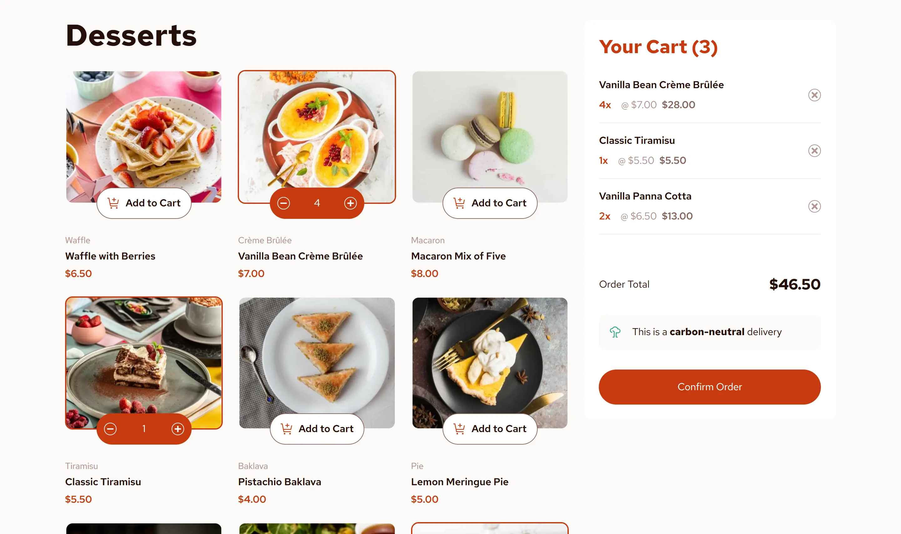

# Frontend Mentor - Product List with Cart Solution

This is a solution to the [Product list with cart challenge on Frontend Mentor](https://www.frontendmentor.io/challenges/product-list-with-cart-5MmqLVAp_d). Frontend Mentor challenges help you improve your coding skills by building realistic projects.

## Table of contents

- [Overview](#overview)
  - [The challenge](#the-challenge)
  - [Screenshot](#screenshot)
  - [Links](#links)
- [My process](#my-process)
  - [Built with](#built-with)
  - [What I learned](#what-i-learned)
  - [Continued development](#continued-development)
- [Author](#author)

## Overview

### The challenge

Users should be able to:

- Add items to the cart and remove them
- Increase/decrease the number of items in the cart
- See an order confirmation modal when they click "Confirm Order"
- Reset their selections when they click "Start New Order"
- View the optimal layout for the interface depending on their device's screen size
- See hover and focus states for all interactive elements on the page

### Screenshot

### Links

- Solution URL: <https://www.frontendmentor.io/solutions/product-list-with-cart-using-astro-vue-and-tailwind-css-E8xzeFueCC>
- Live Site URL: <https://product-list-f2j.pages.dev/>

## My process

### Built with

- Semantic HTML5 markup
- Mobile-first workflow
- [Astro](https://astro.build/) - JS framework
- [Vue](https://vuejs.org/) - JS framework
- [Tailwind CSS](https://tailwindcss.com/) - CSS framework

### What I learned

Starting a project with Vue after more than 3 years of using React/JSX is such a fun and interesting experience. I really like how this project turned out and reminded me how delightful the developer experience is when using Vue.

For the mobile layout I've improved the cart position to be a toggle-able modal so users don't need to scroll down every time to view the cart.

### Continued development

Adding some animations on adding/deleting items on the cart would be nice

## Author

- Website - [Momentum Web & Apps Development](https://momentum-web.pages.dev/)
- Frontend Mentor - [@yogaajie2](https://www.frontendmentor.io/profile/yogaajie2)
- LinkedIn - [yogajie](https://www.linkedin.com/in/yogajie/)
- Github - [yogaajie2](https://github.com/yogaajie2)
